# Part 1

### 1.1 Getting started

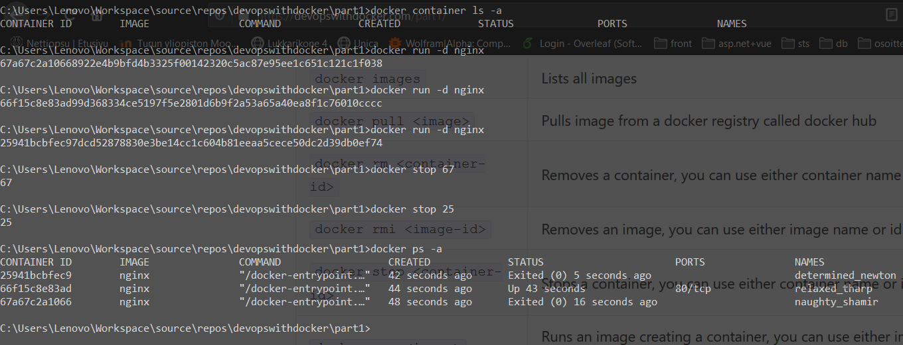

### 1.2 Cleanup

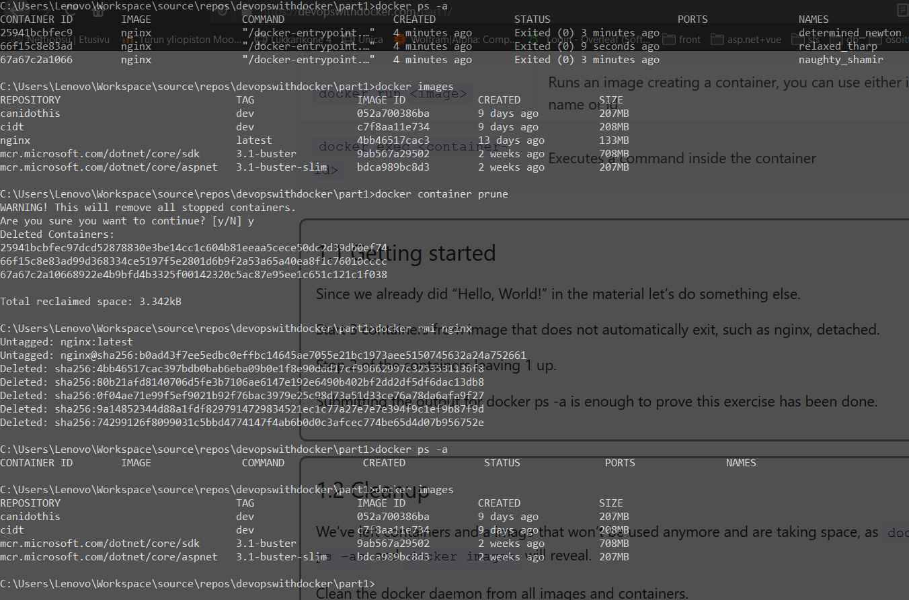

### 1.3 Hello Docker Hub

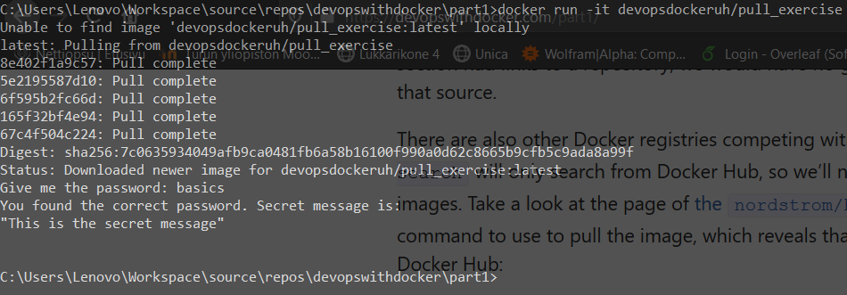

### 1.4

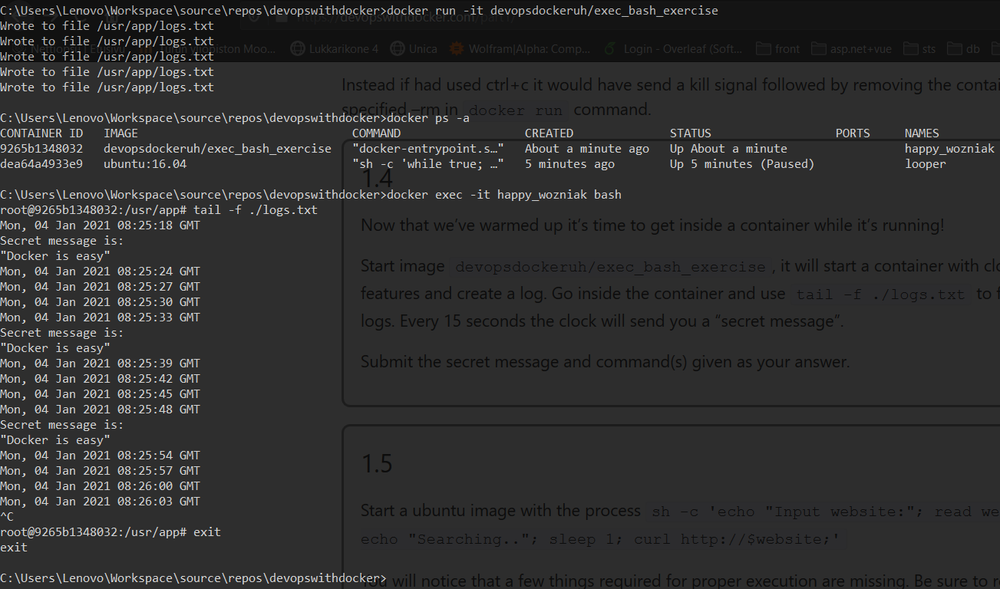

### 1.5

The easiest, simplest method that I came up with

```
docker run -it -d --name ubuntu ubuntu:16.04 // let's run an ubuntu image in a (detached) container
docker exec -it ubuntu sh // invade that juicy container with shell
```
Once connected to the shell: (following magic happens inside the container)

```
(# apt update // optional, I guess, if the next one works ok, I don't really know unix systems that well, man)
# (sudo) apt install curl
(# curl helsinki.fi // for testing, if unsure like I am)
# exit // get out
```
And now we have a container running ubuntu with curl installed and can run the given shell script

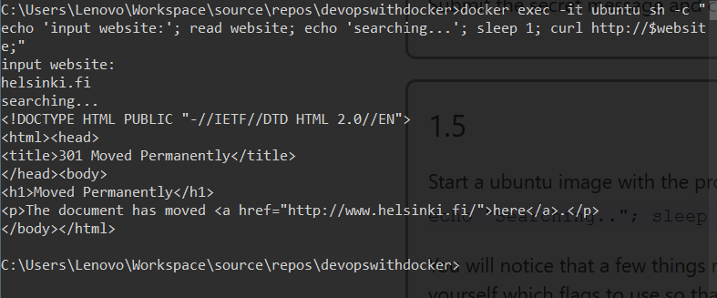

### 1.6

[Dockerfile](./Dockerfiles/six/Dockerfile.1)

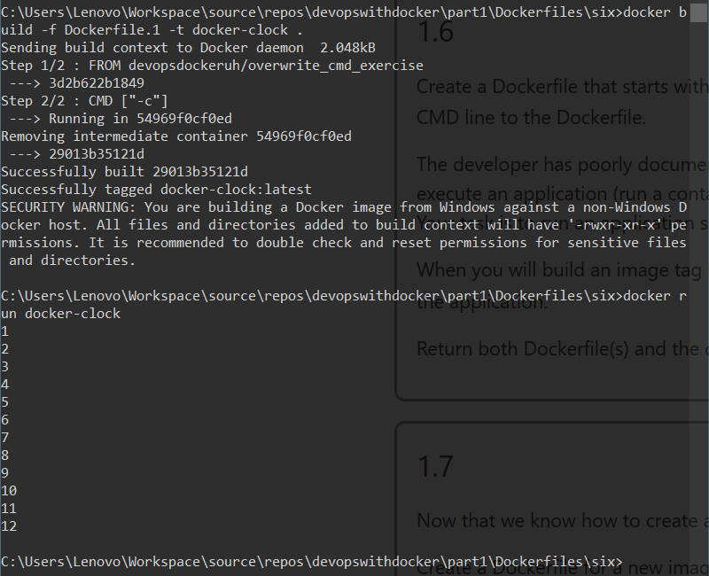

### 1.7

[Dockerfile](./Dockerfiles/seven/Dockerfile)

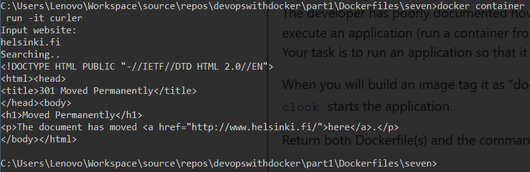

### 1.8

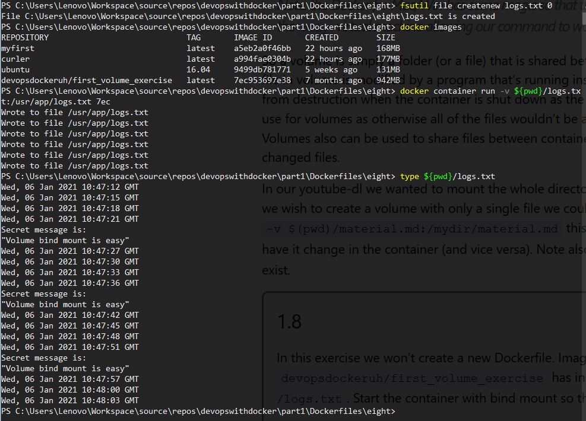

### 1.9

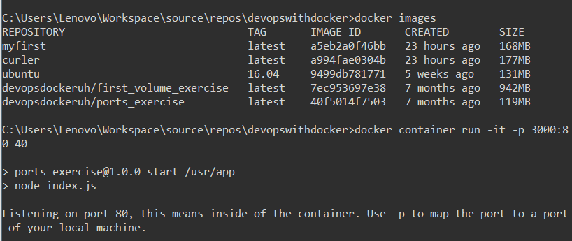

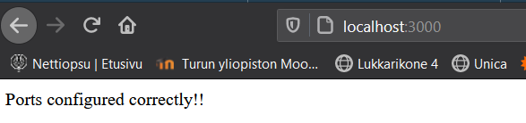

### 1.10

[Dockerfile](./Dockerfiles/frontend-example-docker-master/Dockerfile)

### 1.11

[Dockerfile](./Dockerfiles/backend-example-docker-master/Dockerfile)

This is basically the same way as used in 1.9 because the exercise was a bit ambiguous, it was unclear if simply binding volumes (as a text file) were acceptable or if the goal was to name a specific volume that docker would handle. I did this because I'm running out of time.

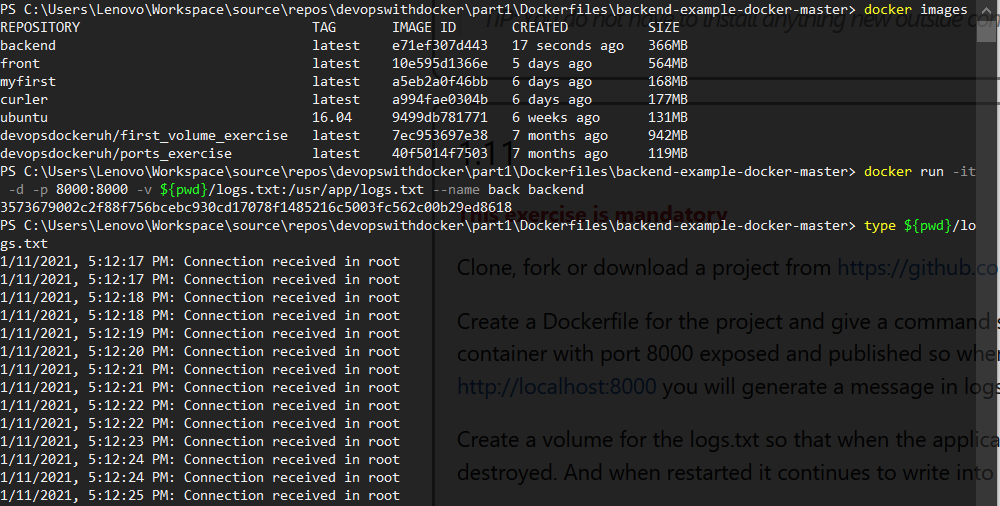
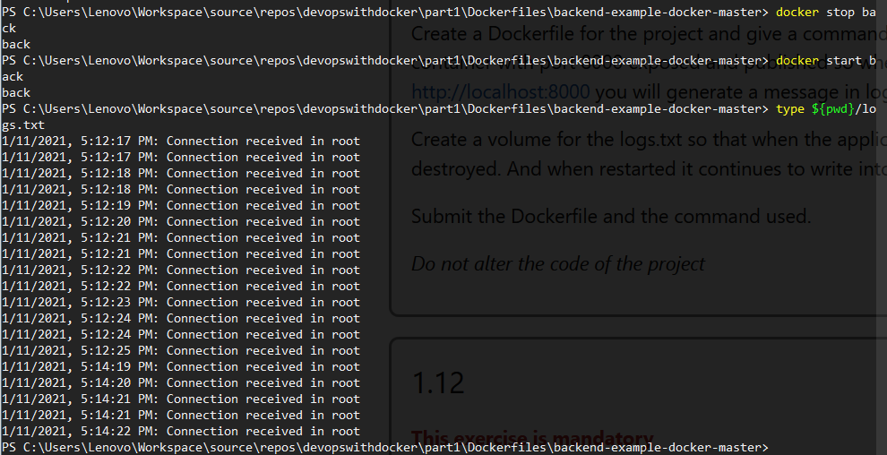

### 1.12

[Front](./Dockerfiles/frontend-example-docker-master/Dockerfile)
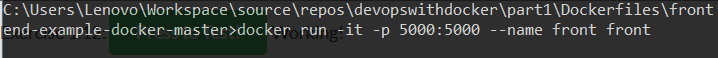
[Back](./Dockerfiles/backend-example-docker-master/Dockerfile)
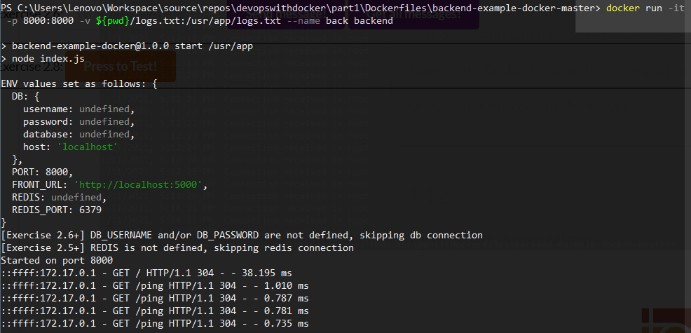

### 1.13

[Dockerfile](./Dockerfiles/spring-example-project-master/Dockerfile)
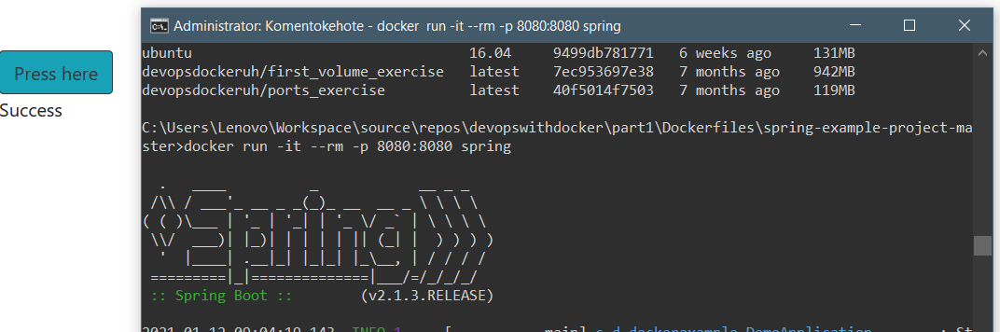

### 1.14

[Dockerfile](./Dockerfiles/rails-example-project-master/Dockerfile)

```
Running it with
$ docker run -it -p 3000:3000 <image>
```

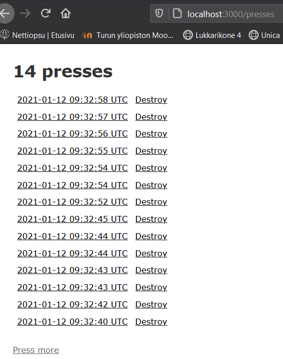