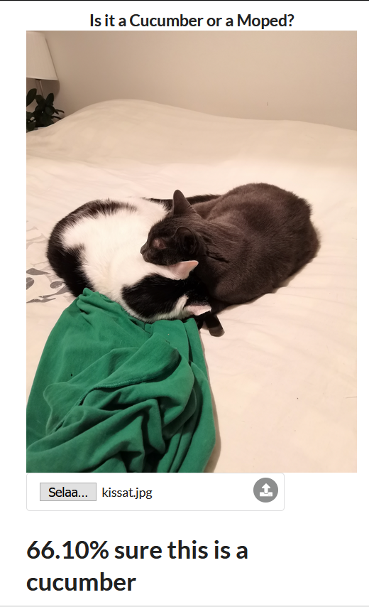

# Part 2

### 2.1

[Compose](./one/docker-compose.yml)

### 2.2

[Compose](./two/docker-compose.yml)

### 2.3

Substitute the image sources with your own.

[Compose](./three/docker-compose.yml)

### 2.4

```
$ docker-compose up -d --scale compute=3
```

### 2.5

Substitute the image sources with your own.

[Compose](./five/docker-compose.yml)

### 2.6

[Compose](./six/docker-compose.yml)

### 2.7

[Compose](./seven/docker-compose.yml)



### 2.8

[Compose](./eight/docker-compose.yml)