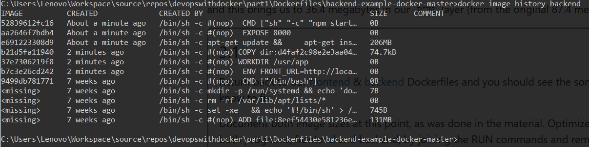
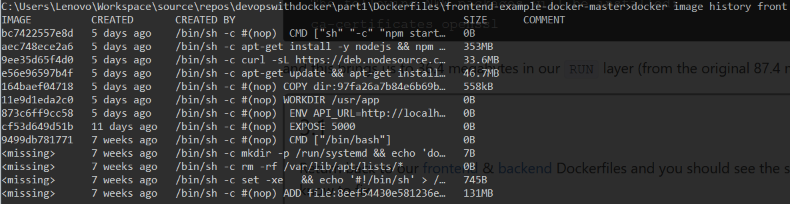
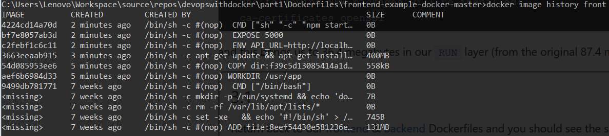
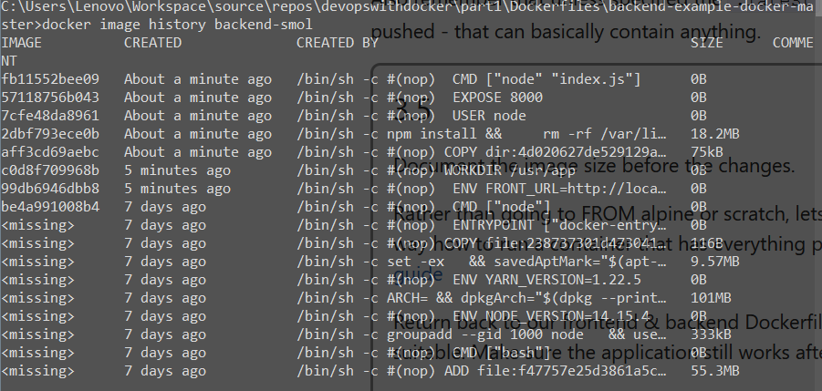
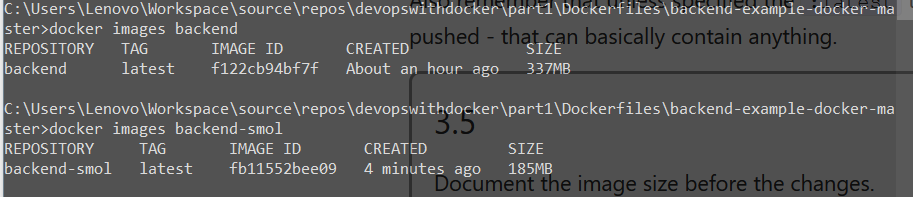
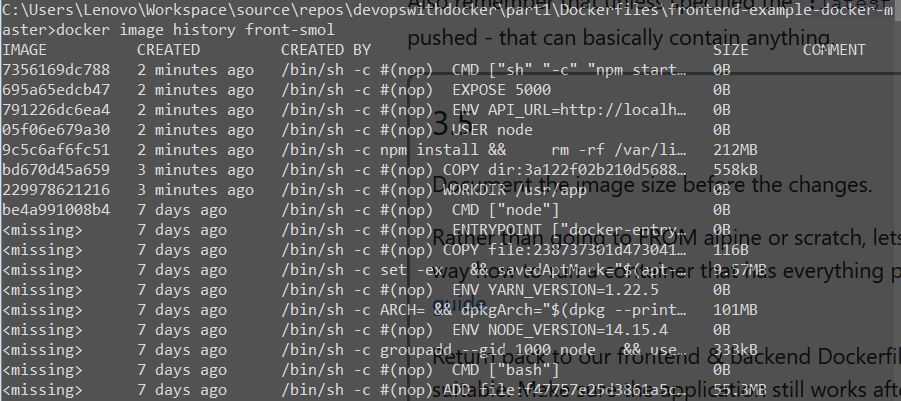
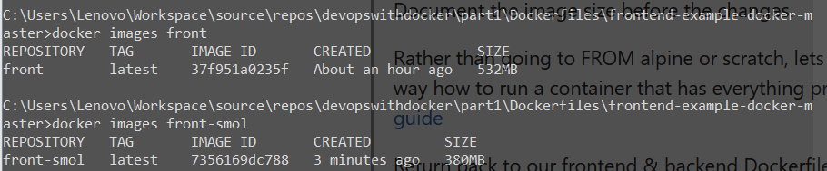

# Part 3

## 3.1

(To make things easier, I am doing these changes straight into the original Dockerfile to avoid having to duplicate the original code. The file can be seen as it was before changes [in part 1] from commit history. I wish I had known beforehand that I would be using these example projects in all three sections of this course, then I would have put them in a separate folder instead of putting them under the part that it was introduced in.)

### Backend

Backend Dockerfile before changes:

```Dockerfile
FROM ubuntu:16.04
EXPOSE 8000
ENV FRONT_URL="http://localhost:5000"

WORKDIR /usr/app
COPY . .
RUN apt-get update && apt-get install -y curl
RUN curl -sL https://deb.nodesource.com/setup_14.x | bash
RUN apt-get install -y nodejs && npm install
CMD [ "sh", "-c", "npm start" ]
```

Backend image history before changes:


Backend Dockerfile after changes:

```Dockerfile
FROM ubuntu:16.04

ENV FRONT_URL="http://localhost:5000"

WORKDIR /usr/app
COPY . .

RUN apt-get update && \
    apt-get install -y curl && \
    curl -sL https://deb.nodesource.com/setup_14.x | bash && \
    apt-get install -y nodejs && \
    npm install && \
    apt-get purge -y --auto-remove curl && \
    rm -rf /var/lib/apt/lists/*

EXPOSE 8000
CMD [ "sh", "-c", "npm start" ]
```

Backend image history after changes:



Frontend Dockerfile before changes:

```Dockerfile
FROM ubuntu:16.04
EXPOSE 5000
ENV API_URL="http://localhost:8000"

WORKDIR /usr/app
COPY . .
RUN apt-get update && apt-get install -y curl
RUN curl -sL https://deb.nodesource.com/setup_14.x | bash
RUN apt-get install -y nodejs && npm install
CMD [ "sh", "-c", "npm start" ]
```

Frontend image history before changes:



Frontend Dockerfile after changes:

```Dockerfile
FROM ubuntu:16.04

WORKDIR /usr/app
COPY . .

RUN apt-get update && \
    apt-get install -y curl && \
    curl -sL https://deb.nodesource.com/setup_14.x | bash && \
    apt-get install -y nodejs && \
    npm install && \
    apt-get purge -y --auto-remove curl && \
    rm -rf /var/lib/apt/lists/*

ENV API_URL="http://localhost:8000"
EXPOSE 5000
CMD [ "sh", "-c", "npm start" ]
```

Frontend image history after changes:



### 3.2

Github https://github.com/peterikaisa/sample-project

Docker Hub https://hub.docker.com/r/peterikaisa/sample-project

Heroku https://sample-project-k.herokuapp.com/

### 3.4

[Backend dockerfile](..\part1\Dockerfiles\backend-example-docker-master\Dockerfile)

[Frontend dockerfile](..\part1\Dockerfiles\frontend-example-docker-master\Dockerfile)

Added changes to both (both located in part1 folder)

```Dockerfile
    && \
    useradd -m app && \
    chown -R app .
    
USER app
```

### 3.5

Image sizes are as in 3.1 (after 3.1 changes). To maintain some consistency between the exercises I made new dockerfiles for this exercise for both example projects titled `Dockerfile.smol`. Since the projects are build straight from the dockerfiles the apps don't obviously have any of the functionality defined in part 2, so when running them both only exercises 1.10 and 1.12 work.

[Backend dockerfile](..\part1\Dockerfiles\backend-example-docker-master\Dockerfile.smol)

[Frontend dockerfile](..\part1\Dockerfiles\frontend-example-docker-master\Dockerfile.smol)









### 3.6

Once again, I made a new dockerfile called `Dockerfile.multi` for clarity.

[Dockerfile](..\part1\Dockerfiles\frontend-example-docker-master\Dockerfile.multi)